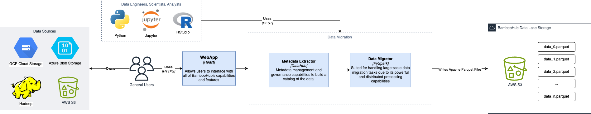

# ADR 1: Apache Parquet for Primary Data Storage

| Category   | Value            |
| ---------- | ---------------- |
| Identifier | adr-0001         |
| Status     | Accepted         |
| Author(s)  | Ao Wang          |
| Date:      | April 30th, 2024 |

**keywords:** Apache Parquet, Data Lake, Data-as-a-Service, Cloud Storage, Columnar Data File Format

As a Data-as-a-Service (DaaS) lakehouse platform, we provide:

- Cloud storage
- Data migration from other cloud storage providers to BambooHub
- Live connection to other cloud storage providers

The driving force behind this design decision is the need to store all types of data cost-effectively while maintaining lightning-fast query times.

## Decision

We will utilize Apache Parquet, an open-source, column-oriented data file format known for its versatility. This ensures that when uploading flat files or any tabular data, such as CSV and Excel, to our platform, we will convert them to Parquet files, providing a secure and compatible storage solution for your data.

## Rationale

Our platform used Apache Parquet because it's designed for efficient data storage and retrieval. It provides efficient data compression and encoding schemes with enhanced performance to handle complex data in bulk. Additionally, it supports complex data types and advanced nested data structures, which will work well with most data.

Rejected Alternatives:

- CSV
  - Although widely used, it's inefficient for large datasets because it's a row-based storage format. It'll result in slow queries, especially if only a subset of columns are needed.
  - Additionally, there's no support for data types, which could lead to data loss or errors when importing data.
- Avro
  - Like Parquet, it supports schema evolution, enabling schema modification without changes to the data.
  - However, it is also row-based, which is inefficient for the same reasons CSV is.
  - The schema definition for Avro can be complex, which is challenging to work with
- Optimized Row Columnar (ORC)
  - ORC is commonly used in cases where high-speed writing is necessary, and it supports ACID properties
  - Like Apache Parquet, ORC is a type-aware columnar file format designed for Hadoop workloads.
  - Compared to Parquet, ORC has less community support, meaning fewer resources, libraries, and tools for this file format.

Below shows a cost and query speed comparison between storing data as CSV versus Apache Parquet. [Source](https://www.databricks.com/glossary/what-is-parquet)

| Dataset                              | Size on Amazon S3           | Query Run Time | Data Scanned          | Cost          |
| ------------------------------------ | --------------------------- | -------------- | --------------------- | ------------- |
| Data stored as CSV files             | 1 TB                        | 236 seconds    | 1.15 TB               | $5.75         |
| Data stored in Apache Parquet Format | 130 GB                      | 6.78 seconds   | 2.51 GB               | $0.01         |
| Savings                              | 87% less when using Parquet | 34x faster     | 99% less data scanned | 99.7% savings |

## Consequences

Some downsides to Apache Parquet is that its column-wise compression and encoding write costs can be high for write-heavy workloads. Additionally, for small data sets the file format isn't able to take advantage of all its features. The downsides are negigible as a DaaS data lake platform, we're in the business of collecting and maintaining data, so efficient storage and fast queries are crucial.

