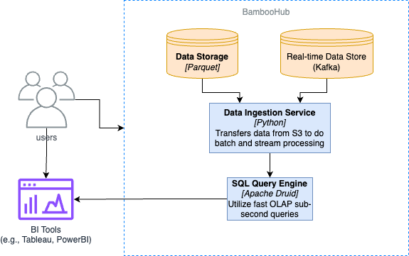

# ADR 2: Apache Druid for Lightning Fast OLAP SQL Queries

| Category   | Value            |
| ---------- | ---------------- |
| Identifier | adr-0002         |
| Status     | Accepted         |
| Author(s)  | Ao Wang          |
| Date:      | April 30th, 2024 |

**keywords:** Apache Druid, OLAP, SQL, Query, Tableau, PowerBI, Data Visualization

The driving force for influencing this design decision is boosting query processing times. Platforms such as Tableau and PowerBI are used to visualize data, but they need to query the data first. The longer the query time, the longer it takes to visualize the data. This will also result in more resources being used, which can lead to higher costs.

## Decision

The driving force behind this design decision is boosting query processing times. Platforms such as Tableau and PowerBI visualize data, but they need to query it first. The longer the query time, the longer it takes to visualize the data. This will also result in more resources being used, which can lead to higher costs.

## Rationale

We will utilize Apache Druid, an open-source, distributed, column-oriented OLAP database, for lightning-fast SQL queries. Druid is designed for sub-second query times, which is crucial for our platform. We will use Druid for our OLAP SQL queries, which data analysts can use to visualize data in Tableau and PowerBI. Moreover, Druid's real-time streaming ingestion and horizontal scalability without performance degradation were key factors in our decision. These features make it the ideal choice for organizations that require real-time data for decision-making, a critical aspect of our dashboarding platform.

Rejected Alternatives:

- DuckDB
  - DuckDB is an in-memory analytical database system that is designed for OLAP queries. It's designed for high performance and is able to handle complex queries.
  - However, DuckDB is not designed for real-time streaming ingestion, which is crucial for our platform. Additionally, DuckDB is not designed to scale horizontally.
- SQLite
  - SQLite is a self-contained, serverless, zero-configuration, transactional SQL database engine. It's designed for simplicity and ease of use.
  - However, SQLite is not designed for OLAP queries and is not designed for high concurrency.

## Consequences

Some downsides to Apache Druid is that we primarily store data in Apache Parquet, which is a columnar storage format. Luckily, Druid is designed to work with columnar storage formats, but Druid primarily works with Segments, which are immutable, time-ordered collections of data. This is not a major issue, since Druid has a parquet extension.

Additionally, we are able to ingest data in real-time and store the data as segments, but this can lead to higher storage costs. Therefore, the strategy is to transform the data from segments to Parquet files to reduce storage costs.

And if we want to do batch processing, we'll need to transform the data from Parquet files to segments. However, the benefits of Druid far outweigh the downsides, as we're in the business of providing lightning-fast OLAP SQL queries, which is crucial for our platform.

