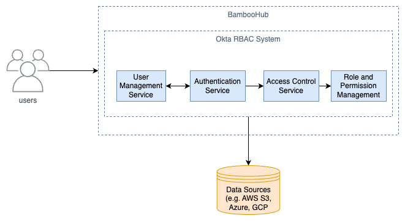

# ADR 3: Role-Based Permissions

| Category   | Value            |
| ---------- | ---------------- |
| Identifier | adr-0003         |
| Status     | Accepted         |
| Author(s)  | Ao Wang          |
| Date:      | April 30th, 2024 |

Some data should only be accessible to certain users. For example, a user should only be able to access their data and not other users' data. However, in an organization, different roles have different data access levels. For example, a manager may have access to all data, while a regular employee may only have access to their own data. Another example may be a hospital. Since patient data is sensitive, only doctors and nurses should have access to patient data. This is crucial for security and privacy reasons and compliance with regulations such as GDPR and HIPAA.

## Decision

We will utilize Okta's role-based access control (RBAC) to control access to data. RBAC will have core elements of administrators, roles, and permissions. Administrators will be able to create roles and assign permissions to them. Roles will be assigned to users, and permissions will be assigned to roles. This will allow for fine-grained access control to data.

## Rationale

The driving force that influences this design decision is security and privacy. We need to ensure that data is only accessible to those who are authorized to access it. Additionally, we must ensure that we comply with regulations such as GDPR and HIPAA. Okta's RBAC is a widely used and well-documented solution for role-based access control. On our platform, the consumers can create their own roles and assign permissions to those roles, deciding who can read and write data.

The main alternative to Okta's RBAC is to build our role-based access control system. However, this would require a lot of development time and resources. Okta's RBAC is a widely used and well-documented solution, which means it's more likely to be secure and compliant with regulations such as GDPR and HIPAA.

## Consequences

Since we use a third-party solution, we depend on Okta's RBAC. If Okta's RBAC goes down, we cannot control access to data. However, the benefits of using Okta's RBAC far outweigh the downsides. Not only does it provide secure and compliant access to data, which is crucial for our platform, but it also helps save money on development time and resources, making it a cost-effective choice.

