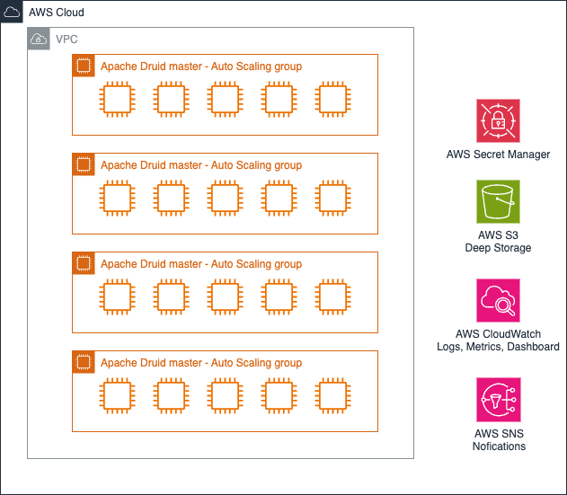

# ADR 4: Containerization Strategy

| Category   | Value            |
| ---------- | ---------------- |
| Identifier | adr-0004         |
| Status     | Accepted         |
| Author(s)  | Ao Wang          |
| Date:      | April 30th, 2024 |

**keywords:** Docker, Kubernetes, Containerization, Microservices, DevOps

The driving force influencing this design decision is making the deployment process more efficient. We must ensure our platform is scalable, reliable, and easy to deploy and manage.

## Decision

We will utilize AWS Elastic Kubernetes Service (EKS) for container orchestration and EC2 instances for our compute resources.

## Rationale

Scalability: Using EKS with EC2 instances allows our infrastructure to scale dynamically based on the workload, which is essential for handling varying loads typical in data analytics platforms like Apache Druid.

Flexibility: EKS provides the flexibility to configure the Kubernetes cluster to meet specific needs, including network configurations and security settings. EC2 instances offer a range of types that can be optimized for compute, memory, or storage, depending on the Druid component requirements.

Reliability: Kubernetes’ self-healing features, such as automated restarts of failed containers and pods, enhance the reliability of the entire platform.

Rejected Alternatives:

- ECS with Fargate: While simpler and potentially easier to manage, it lacks the fine-grained control and extensive configuration options that Kubernetes offers. Fargate’s pricing model and performance characteristics at scale also proved less optimal for our high-performance needs.
- Pure EC2 Instances without Kubernetes: Managing scaling, deployment, and orchestration without Kubernetes would significantly increase complexity and reduce operational efficiency. The lack of container orchestration would also hinder our ability to deploy updates and manage the state effectively.
- On-premise Kubernetes: Would increase operational complexity and require significant upfront capital investment in hardware and maintenance, reducing our ability to scale quickly and cost-effectively.

## Consequences

- Positive Consequences:
  - Enhanced Operational Efficiency: Streamlined deployments and management of the Apache Druid infrastructure due to Kubernetes’ orchestration capabilities.
  - Cost Optimization: Ability to scale resources up or down based on demand, ensuring we only pay for what we use and can adjust as needed without over-provisioning.
  - Improved Disaster Recovery: Kubernetes enhances our disaster recovery capabilities with its robust failover and backup mechanisms.
- Negative Consequences:
  - Complexity in Management: There is an increased complexity in managing a Kubernetes environment, requiring specialized skills and potentially leading to higher operational overhead.
  - Dependency on AWS: By choosing EKS and EC2, we are further locking ourselves into the AWS ecosystem, which could limit our options should we wish to diversify our cloud strategy in the future.
  - Cost of Expertise: While operational costs are optimized, the cost of acquiring or training for specialized Kubernetes expertise can be significant.

