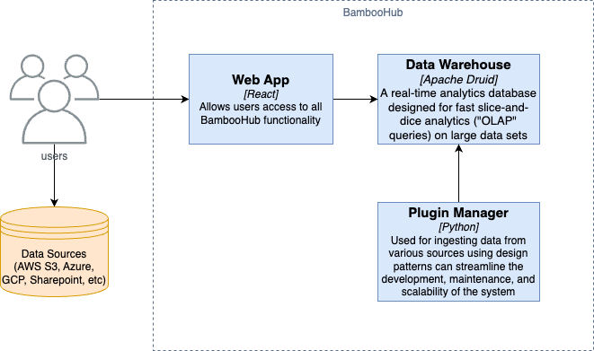
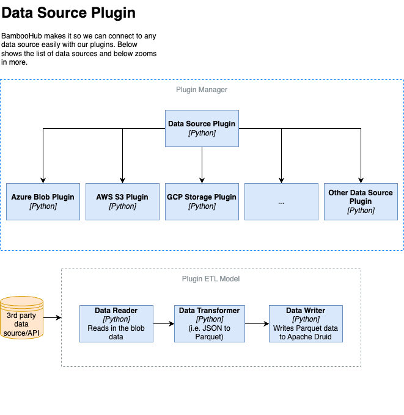

# ADR 5: Data Source Integration

| Category   | Value            |
| ---------- | ---------------- |
| Identifier | adr-0005         |
| Status     | Accepted         |
| Author(s)  | Ao Wang          |
| Date:      | April 30th, 2024 |

The data source integration is a critical part of the system. The system needs to integrate with different data sources, such as databases, APIs, file systems, and many cloud storage providers, like Azure Blob Storage, GCP Storage, and AWS S3. The system should be able to read data from these sources, process the data, and write the data back to the sources. The system should also be able to handle different data formats, such as JSON, XML, CSV, and Parquet.

## Decision

We will implement a modular plugin architecture for each data source integration. This approach allows easy addition or modification of data source connectors, which can be independently developed and maintained without affecting the core system.

## Rationale

Flexibility: Modular plugins allow each data source to be integrated as a separate module, which can be added, updated, or removed without impacting other parts of the system.

Scalability: As BambooHub grows and needs to incorporate more data sources, the plugin architecture supports scaling without major restructuring.

Maintainability: Individual plugins can be maintained by different teams or updated to leverage improvements in the respective data storage technologies, improving the overall maintainability of the system.

Rejected alternatives:

- Monolithic Architecture: Integrating all data sources directly into the core application was considered but rejected due to high maintenance complexity and inflexibility in adapting to changes in data sources.
- Third-Party Integration Tools: Using external platforms or services for integration was also considered but dismissed because of potential issues with data governance, higher operational costs, and less control over the integration process.

## Consequences

Positive Consequences:
  - Enhanced Adaptability: The system can quickly adapt to changes in data storage technologies and integration requirements.
  - Ease of Integration: New data sources can be added with minimal impact on the existing infrastructure, facilitating growth and expansion.
  - Focused Development: Developers can focus on specific integrations without needing comprehensive knowledge of the entire system, leading to more efficient development cycles.

Negative Consequences:
  - Increased Complexity: Managing multiple independent plugins can introduce complexity in terms of dependency management and system configuration.
  - Overhead in Coordination: Coordinating updates across various plugins, especially when they affect shared functionalities, requires meticulous planning and testing.
  - Variability in Plugin Quality: Depending on the development practices and standards, there might be variability in the quality and performance of different plugins.

